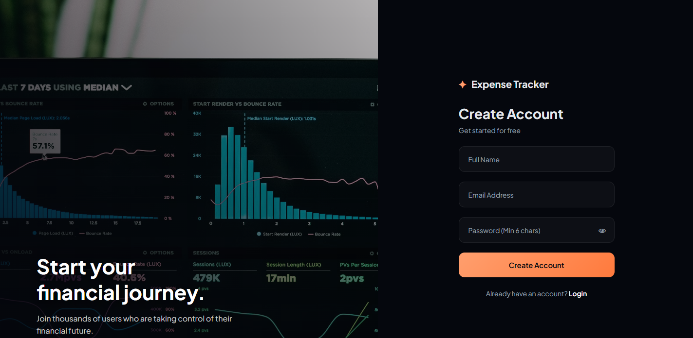
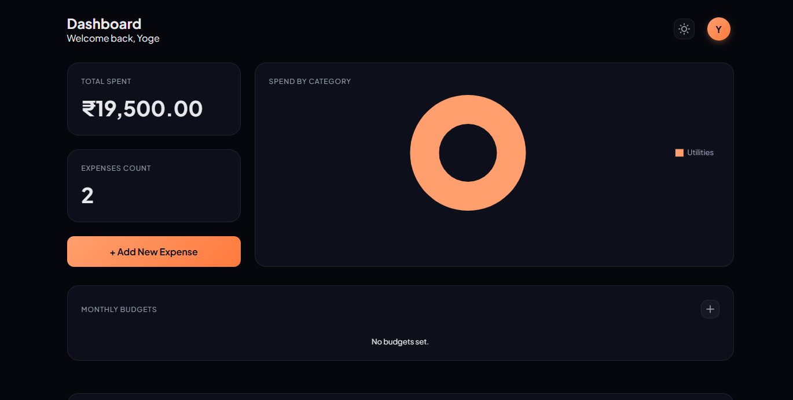

# 💰 Expense Tracker System

A modern, secure, and cinematic **Expense Tracker Application** built with **Spring Boot** (Backend) and **Vanilla JavaScript/CSS** (Frontend). Designed to track personal finances with a high-performance dark mode UI, real-time charts, and JWT authentication.

---

## 📖 Table of Contents
<ul>
  <li><a href="#-features">🚀 Features</a></li>
  <li><a href="#-tech-stack">🛠️ Tech Stack</a></li>
  <li><a href="#-screenshots">📸 Screenshots</a></li>
  <li><a href="#-installation--setup">⚙️ Installation & Setup</a></li>
  <li><a href="#-configuration">🔧 Configuration</a></li>
  <li><a href="#-api-endpoints">🔌 API Endpoints</a></li>
  <li><a href="#-project-structure">📂 Project Structure</a></li>
</ul>

---

## <a id="-features"></a>🚀 Features

### 🔐 Authentication & Security
* **Secure Registration & Login**: Encrypted passwords (BCrypt) and JWT-based stateless session management.
* **Role-Based Isolation**: Data is strictly isolated per user (Users cannot access others' expenses).

### 📊 Dashboard & Analytics
* **Real-Time Statistics**: Instant calculation of total spending and transaction counts.
* **Visual Charts**: Interactive Doughnut Chart (Chart.js) visualizing spending distribution by category.
* **Formatted Data**: Expenses are displayed with formatted currency (INR) and readable dates.

### 💸 Expense Management
* **Add Expenses**: Modal-based entry with date validation (future dates restricted).
* **Custom Categories**: Users can add their own custom categories (e.g., "Gym", "Pets") or use global defaults.
* **Delete Functionality**: One-click deletion for expenses.

### ⚙️ User Settings
* **Profile Management**: Displays logged-in user's name dynamically.
* **Account Deletion**: Full data wipe capabilities (Cascading delete removes User, Categories, and Expenses).

### 🎨 UI/UX Design
* **Cinematic Dark Mode**: Immersive deep backgrounds with ambient lighting effects.
* **Glassmorphism**: Translucent card designs with blur filters.
* **Responsive Layout**: Optimized for both desktop and mobile views.

---

## <a id="-tech-stack"></a>🛠️ Tech Stack

### Backend
* **Java 17**
* **Spring Boot 3** (Web, Data JPA, Validation, Security)
* **H2 Database** (In-Memory SQL)
* **Hibernate** (ORM)
* **JWT (JSON Web Tokens)** for Security

### Frontend
* **HTML5 & CSS3** (Custom "Cinematic" Design System)
* **JavaScript (ES6+)** (Fetch API)
* **Chart.js** (Data Visualization)

---

## <a id="-screenshots"></a>📸 Screenshots

| **Login Screen** | **Register Screen** |
|:---:|:---:|
|  |  |

| **Dashboard & Chart** | **Add Expense Modal** |
|:---:|:---:|
|  |  |

*(Note: Replace `screenshots/*.png` with your actual file paths)*

---

## <a id="-installation--setup"></a>⚙️ Installation & Setup

### Prerequisites
1. **JDK 17** or higher
2. **Maven**
3. **VS Code** (with "Live Server" extension recommended)

### 1. Clone the Repository
```bash
git clone [https://github.com/yourusername/expense-tracker.git](https://github.com/yourusername/expense-tracker.git)
cd expense-tracker
```

### 2. Backend Setup
1. Open the project in your IDE (IntelliJ / Eclipse / VS Code).
2. Run the application:
```bash
mvn spring-boot:run
```
*The server will start at `http://localhost:8080`.*

### 3. Frontend Setup
1. Open the `frontend` folder in **VS Code**.
2. Right-click `index.html` and select **"Open with Live Server"**.
3. The app will launch at `http://127.0.0.1:5500`.

---

## <a id="-configuration"></a>🔧 Configuration

Ensure your `src/main/resources/application.properties` matches this configuration for H2 and JWT:

```properties
# Server
server.port=8080

# H2 Database
spring.datasource.url=jdbc:h2:mem:expensetrackerdb
spring.datasource.driver-class-name=org.h2.Driver
spring.datasource.username=sa
spring.datasource.password=
spring.jpa.defer-datasource-initialization=true
spring.sql.init.mode=always

# Security
jwt.secret=404E635266556A586E3272357538782F413F4428472B4B6250645367566B5970
jwt.expiration-ms=86400000
```

---

## <a id="-api-endpoints"></a>🔌 API Endpoints

### Authentication
| Method | Endpoint | Description |
| :--- | :--- | :--- |
| `POST` | `/api/auth/register` | Register a new user |
| `POST` | `/api/auth/login` | Login and receive JWT |

### Expenses
| Method | Endpoint | Description |
| :--- | :--- | :--- |
| `GET` | `/api/expenses/user/{id}` | Get all expenses for a user |
| `POST` | `/api/expenses/user/{id}` | Create a new expense |
| `DELETE` | `/api/expenses/{expId}/user/{userId}` | Delete a specific expense |

### Categories
| Method | Endpoint | Description |
| :--- | :--- | :--- |
| `GET` | `/api/categories/global` | Fetch default system categories |
| `POST` | `/api/categories/user/{id}` | Create a custom user category |
| `GET` | `/api/categories/user/{id}` | Fetch user's custom categories |

### User
| Method | Endpoint | Description |
| :--- | :--- | :--- |
| `DELETE` | `/api/users/{id}` | Delete user account and all data |

---

## <a id="-project-structure"></a>📂 Project Structure

```
expensetracker
├── frontend                     # Frontend Code (HTML/CSS/JS)
│   ├── css
│   │   └── style.css
│   ├── js
│   │   ├── api.js
│   │   ├── auth.js
│   │   ├── dashboard.js
│   │   └── register.js
│   ├── dashboard.html
│   ├── index.html
│   └── register.html
├── src                          # Backend Source Code
│   └── main
│       ├── java/com/example/expensetracker
│       │   ├── config           # Security & CORS Config
│       │   ├── controller       # REST Controllers
│       │   ├── dto              # Data Transfer Objects
│       │   ├── exception        # Global Exception Handling
│       │   ├── mapper           # Entity <-> DTO Mappers
│       │   ├── model            # JPA Entities
│       │   ├── repository       # Database Interfaces
│       │   ├── security         # JWT Filters & UserDetails
│       │   └── service          # Business Logic
│       └── resources
│           ├── application.properties
│           └── data.sql         # Initial Category Seeding
```

---

## 📝 License
This project is licensed under the Apache License, Version 2.0.
See the LICENSE file for details.
